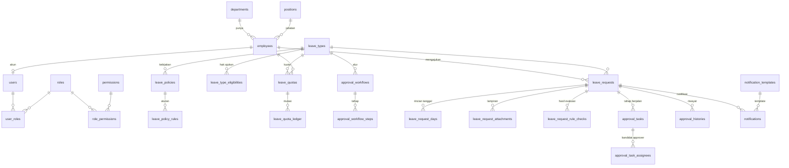

# SAPP — Struktur Database

Sistem Auto Approval Perizinan Pegawai.
Stack target: **Nuxt 4 (TypeScript, Nitro server) + PostgreSQL 16 + Podman + Tailwind + Alpine.js**.

| File | Isi |
|---|---|
| `01_schema.sql` | Seluruh DDL: extension, enum, 33 tabel, index, constraint, trigger, fungsi, view |
| `02_seed.sql` | Data master + aturan dummy (jam kerja, role, pegawai, jenis izin, rule, workflow, template notifikasi) |
| `DATABASE.md` | Dokumen ini |

---

## 1. Ringkasan kelompok tabel

| Kelompok | Tabel | Fungsi |
|---|---|---|
| Organisasi | `departments`, `positions`, `employees` | Struktur perusahaan, jabatan berjenjang (`positions.level`), atasan langsung (`employees.manager_id`) |
| Auth & RBAC | `users`, `roles`, `permissions`, `role_permissions`, `user_roles`, `user_sessions`, `password_reset_tokens` | Login + 3 jenis user (EMPLOYEE / APPROVER / ADMIN, plus HR_APPROVER) |
| Jenis izin | `leave_types`, `leave_type_eligibilities` | 6 jenis izin + pengaturan siapa yang berhak mengajukan |
| Aturan | `leave_policies`, `leave_policy_rules` | Rule engine berbasis data: aturan berbeda per jenis izin, versi per periode |
| Kuota | `leave_quotas`, `leave_quota_ledger` | Saldo cuti + buku besar mutasi kuota |
| Alur approval | `approval_workflows`, `approval_workflow_steps`, `approval_delegations` | Konfigurasi approval bertingkat oleh admin |
| Pengajuan | `leave_requests`, `leave_request_days`, `leave_request_attachments`, `leave_request_rule_checks` | Data pengajuan + rincian per tanggal + hasil evaluasi aturan |
| Eksekusi approval | `approval_tasks`, `approval_task_assignees`, `approval_histories` | Instansi tiap tahap, kandidat approver, timeline riwayat |
| Notifikasi | `notification_templates`, `notification_template_variables`, `notification_preferences`, `notifications`, `in_app_notifications` | Template yang bisa dikustomisasi admin + antrean kirim email/Telegram |
| Sistem | `working_hours`, `holidays`, `system_settings`, `audit_logs`, `job_executions` | Kalender kerja, konfigurasi, audit, log worker |

---

## 2. ERD (inti)



---

## 3. Cara kerja approval bertingkat

1. Pegawai submit → sistem memilih **satu** `approval_workflows` yang paling cocok
   (filter: `leave_type_id`, `department_id`, rentang `min_days`/`max_days`, `employment_status`,
   lalu diurutkan `priority ASC`, `version DESC`).
2. Isi workflow disalin ke `leave_requests.workflow_snapshot` supaya perubahan konfigurasi admin
   **tidak mengubah** pengajuan yang sedang berjalan.
3. Setiap `approval_workflow_steps` yang lolos kondisi (`condition_min_days`) dibuat menjadi satu
   baris `approval_tasks`. Step pertama `PENDING`, sisanya `WAITING`.
4. Kandidat approver di-*resolve* saat step aktif dan disimpan di `approval_task_assignees`:

| `approver_type` | Cara resolusi |
|---|---|
| `DIRECT_MANAGER` | `employees.manager_id` dari pemohon |
| `DEPARTMENT_HEAD` | `departments.head_employee_id` dari departemen pemohon |
| `POSITION_LEVEL` | semua pegawai aktif dengan `positions.level = approver_position_level` (naik ke departemen induk bila kosong) |
| `POSITION` | pegawai dengan jabatan tertentu |
| `SPECIFIC_EMPLOYEE` | satu orang tertentu |
| `ROLE` | semua user dengan role tersebut (mis. `HR_APPROVER`) |
| `HR_DEPARTMENT` | approver pada departemen ber-`is_hr_department = true` |

5. `approval_mode`: `ANY_ONE` (cukup satu), `ALL` (semua harus setuju), `QUORUM` (minimal N).
6. Jika approver sedang cuti dan punya `approval_delegations` aktif, tugas ikut diberikan ke
   delegatnya (`is_delegate = true`).
7. Setiap kejadian dicatat di `approval_histories` → sumber data halaman **Riwayat Approval**
   (lihat view `v_request_timeline`).

---

## 4. Reminder, SLA, dan keputusan otomatis

Dua level batas waktu:

- **Per tahap** — `approval_workflow_steps.sla_hours` → mengisi `approval_tasks.due_at`.
- **Keseluruhan** — `leave_policies.overall_deadline_hours` → mengisi `leave_requests.final_deadline_at`.

Keduanya dihitung dalam **jam kerja** (`working_hours` + `holidays`) bila
`sla_uses_working_hours` / `deadline_uses_working_hours` bernilai true.

Alur worker (cron Nitro, dijalankan tiap 5 menit):

```
reminder-sweeper
  ambil approval_tasks WHERE status='PENDING' AND next_reminder_at <= now()
  → hanya kirim bila sedang jam kerja (reminder_only_working_hours)
  → buat baris notifications untuk tiap assignee (EMAIL + TELEGRAM sesuai reminder_channels)
  → reminder_count++, next_reminder_at = now() + reminder_interval_minutes
  → berhenti bila reminder_count >= reminder_max_count
  → catat APPROVAL_REMINDER di approval_histories

escalation-sweeper
  ambil approval_tasks WHERE status='PENDING' AND due_at <= now()
  → jalankan escalation_action step tsb:
      AUTO_APPROVE        : tahap dianggap setuju (action_source=SYSTEM_AUTO), lanjut tahap berikutnya
      AUTO_REJECT         : pengajuan ditolak
      ESCALATE_NEXT_STEP  : tahap di-SKIP, tahap berikutnya diaktifkan
      ESCALATE_TO_STEP    : lompat ke escalate_to_step_order
      NOTIFY_ADMIN_ONLY   : hanya kirim notifikasi ke admin, tetap menunggu
  ambil leave_requests WHERE status IN ('SUBMITTED','IN_REVIEW') AND final_deadline_at <= now()
  → evaluasi ulang seluruh rule (phase = AUTO_DECISION)
      semua rule lolos  → APPROVED  (auto_approve_reason_template)
      ada yang gagal    → REJECTED  (auto_reject_reason_template, alasan diisi dari
                                     message_template rule yang gagal)
  → is_auto_decided = true, decision_source = 'SYSTEM_AUTO', decision_reason terisi
  → notifikasi ke pemohon + seluruh approver yang terlibat
```

`leave_policies.auto_decision_requires_rule_pass = true` adalah kunci permintaan
"kalau sesuai aturan auto approve, kalau tidak auto reject".

---

## 5. Rule engine

Aturan disimpan sebagai data, bukan kode. Satu baris `leave_policy_rules` =
`rule_type` (jenis pemeriksaan) + `params` (JSON) + `violation_action` + `message_template`.

`violation_action` menentukan akibat pelanggaran:

| Nilai | Arti |
|---|---|
| `BLOCK_SUBMIT` | Form ditolak saat submit, pengajuan tidak pernah masuk antrean |
| `AUTO_REJECT` | Boleh diajukan, tetapi saat batas waktu habis → ditolak otomatis |
| `REQUIRE_APPROVAL` | Boleh diajukan, tetapi **tidak boleh** auto-approve — wajib keputusan manusia |
| `WARN_ONLY` | Hanya peringatan di layar approver |

Contoh aturan WFA yang sudah di-seed (semuanya dummy, bebas diubah admin):

| Kode | Tipe | Params | Akibat |
|---|---|---|---|
| `WFA_MAKS_2_MINGGU` | `MAX_DAYS_PER_PERIOD` | `{"max_days":2,"period":"WEEK"}` | AUTO_REJECT |
| `WFA_TIDAK_BERURUTAN` | `NO_CONSECUTIVE_DAYS` | `{"min_gap_working_days":1}` | AUTO_REJECT |
| `WFA_HARI_BOLEH` | `ALLOWED_WEEKDAYS` | `{"weekdays":[2,3,4]}` | AUTO_REJECT |
| `WFA_MAKS_PER_AJU` | `MAX_DAYS_PER_REQUEST` | `{"max_days":1}` | BLOCK_SUBMIT |
| `WFA_H1` | `MIN_NOTICE_DAYS` | `{"min_notice_days":1,"count":"WORKING"}` | AUTO_REJECT |
| `WFA_KAPASITAS` | `MAX_CONCURRENT_TEAM_ON_LEAVE` | `{"max_people":3,"scope":"DEPARTMENT"}` | REQUIRE_APPROVAL |
| `WFA_STATUS` | `EMPLOYMENT_STATUS_ALLOWED` | `{"statuses":["PERMANENT","CONTRACT"]}` | BLOCK_SUBMIT |

Hasil evaluasi selalu ditulis ke `leave_request_rule_checks` (nilai aktual vs batas ada di
kolom `context`), sehingga alasan penolakan yang dikirim ke pegawai bisa dipertanggungjawabkan.

Daftar lengkap tipe rule dan bentuk `params`-nya ada sebagai komentar pada
`rule_type_enum` di `01_schema.sql`.

---

## 6. Siklus status pengajuan

```
DRAFT ──submit──> SUBMITTED ──tahap 1 aktif──> IN_REVIEW ──┬─> APPROVED
  │                    │                                    ├─> REJECTED
  └──hapus             └──batal──> CANCELLED                └─> EXPIRED (hanya bila
                                                                kebijakan KEEP_WAITING)
```

Constraint `ex_request_no_overlap` mencegah satu pegawai punya dua izin aktif pada tanggal
yang bertumpuk (status `SUBMITTED`, `IN_REVIEW`, `APPROVED`).

---

## 7. Notifikasi yang bisa dikustomisasi

`notification_templates` mendukung kustomisasi bertingkat. Saat mengirim, aplikasi mencari
template dengan urutan spesifik → umum:

1. `employee_id` cocok (pesan khusus untuk approver tertentu)
2. `workflow_step_id` cocok (pesan khusus satu tahap)
3. `leave_type_id` cocok
4. template default (`is_default = true`, ketiganya NULL)

Kunci pencarian: `event_type` + `channel` + `target_audience`.
Placeholder yang tersedia didaftarkan di `notification_template_variables` agar halaman admin
bisa menampilkan tombol sisip variabel. Pengiriman dilakukan lewat tabel antrean
`notifications` (status `QUEUED → SENDING → SENT/FAILED`, `dedupe_key` mencegah pesan dobel).

---

## 8. Asumsi yang saya ambil

1. **Satu perusahaan**, satu zona waktu (`Asia/Jakarta`). Belum multi-tenant/multi-cabang.
2. Approval bertingkat memakai **kombinasi** `DIRECT_MANAGER` dan `POSITION_LEVEL` — keduanya
   tersedia, workflow dummy memakai atasan langsung dulu lalu kepala divisi.
3. Login **email/username + password** (bcrypt), sesi disimpan di tabel `user_sessions`.
4. Satu pegawai = satu akun user; akun `admin` dibuat tanpa data pegawai.
5. Satuan izin **hari** (setengah hari didukung lewat `day_part`, jam belum dipakai).
6. Hanya `CUTI_TAHUNAN` yang memotong kuota (12 hari/tahun, carry over maks 6 hari).
7. Lampiran disimpan di filesystem/volume, DB hanya menyimpan path.
8. Token bot Telegram diambil dari `.env`, bukan dari `system_settings` (kolom `is_secret` hanya
   penanda).
9. Rule dievaluasi di **layer aplikasi** (TypeScript), bukan di PL/pgSQL, supaya mudah diuji;
   database hanya menyimpan definisi dan hasilnya.
10. Semua aturan, SLA, dan interval reminder di `02_seed.sql` adalah **dummy** sesuai permintaan.

---

## 9. Pembagian tugas (ringkas — detail menyusul di dokumen langkah)

| Bisa dikerjakan penuh oleh AI | Harus Anda kerjakan sendiri |
|---|---|
| Semua file SQL, migrasi, dan seed | Menjalankan container Podman + volume |
| Kode Nuxt (server routes, service, komponen, layout Tailwind/Alpine) | Mengisi `.env` (kredensial DB, SMTP, token bot Telegram) |
| Logika rule engine, scheduler, dispatcher notifikasi | Membuat bot Telegram lewat @BotFather |
| Template email/Telegram, halaman admin, halaman riwayat | Menyiapkan akun SMTP / Mailtrap untuk uji coba |
| Unit test + skrip uji manual | Menjalankan `podman exec ... psql -f` untuk memuat SQL |
| Dokumentasi per langkah | Deploy/hosting dan pengaturan firewall |

---

## 10. Perintah Podman (Windows PowerShell) — dijalankan oleh Anda

```powershell
podman volume create sapp-pgdata

podman run -d --name sapp-postgres `
  -e POSTGRES_USER=sapp `
  -e POSTGRES_PASSWORD=sapp_secret `
  -e POSTGRES_DB=sapp `
  -e TZ=Asia/Jakarta `
  -p 5432:5432 `
  -v sapp-pgdata:/var/lib/postgresql/data `
  docker.io/library/postgres:16-alpine

# muat skema + seed
podman cp .\db\01_schema.sql sapp-postgres:/tmp/01_schema.sql
podman cp .\db\02_seed.sql   sapp-postgres:/tmp/02_seed.sql
podman exec -it sapp-postgres psql -U sapp -d sapp -v ON_ERROR_STOP=1 -f /tmp/01_schema.sql
podman exec -it sapp-postgres psql -U sapp -d sapp -v ON_ERROR_STOP=1 -f /tmp/02_seed.sql

# verifikasi
podman exec -it sapp-postgres psql -U sapp -d sapp -c "\dt"
```

Catatan: `01_schema.sql` memakai extension `pgcrypto`, `citext`, dan `btree_gist` yang sudah
tersedia di image resmi `postgres:16-alpine`.

Setelah seed, ganti password placeholder:

```sql
UPDATE users SET password_hash = '<hash_bcrypt_asli>';
```

Hash dibuat lewat skrip Node kecil yang akan saya sertakan pada langkah aplikasi.
